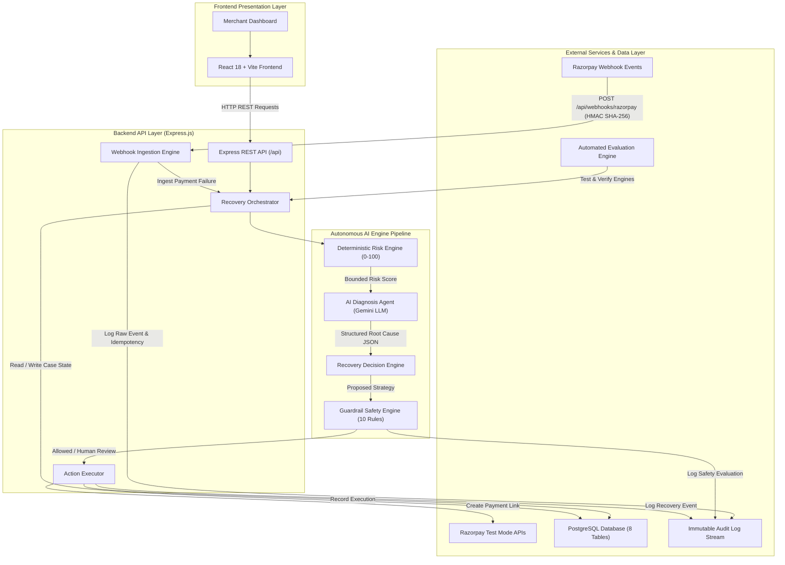

# RazorRecover AI — Architecture Specification & Engineering Guide

> Technical architecture guide detailing system topology, engine interactions, data schemas, security boundaries, and idempotency guarantees.

---

## 1. Professional Architecture Diagram



---

## 2. System Layer & Responsibility Boundaries

### Frontend Layer (`client/src`)
- **Technology:** React 18, Vite, CSS3
- **Role:** Pure presentation & merchant interaction layer.
- **Boundaries:** Connects strictly to backend REST APIs (`/api/metrics`, `/api/recovery-cases`, `/api/audit-logs`, `/api/simulation/simulate-failure`). Contains zero API credentials or business calculation logic.

### Backend API Layer (`server/src`)
- **Technology:** Node.js, Express.js
- **Role:** API routing, risk score calculations, LLM diagnosis invocation, strategy selection, guardrail checks, Razorpay SDK integration.
- **Boundaries:** Holds all secret environment variables (`RAZORPAY_KEY_SECRET`, `RAZORPAY_WEBHOOK_SECRET`). Serves clean, sanitized JSON to frontend.

### Database Layer (`server/src/db`)
- **Technology:** PostgreSQL (`pg` / `pg-mem`)
- **Role:** Append-only audit logging, transaction history, customer profiles, case tracking.
- **Boundaries:** All monetary values stored as `BIGINT` in **paise**. All timestamps stored in `TIMESTAMPTZ`.

---

## 3. The 6-Step Autonomous AI Engine Pipeline

```
1. Webhook Ingestion Engine  ──> HMAC SHA-256 Verification & Event ID Idempotency Check
2. Deterministic Risk Engine ──> Bounded 0–100 Mathematical Scoring (LOW, MED, HIGH, CRITICAL)
3. AI Diagnosis Agent        ──> Gemini LLM Structured JSON Output Classification & Evidence
4. Recovery Decision Engine  ──> Strategy Selection (SILENT_RETRY, PAYMENT_LINK, REMINDER)
5. Guardrail Safety Engine   ──> 10 Sequential Safety Rules & Human Approval Gate (≥₹15,000)
6. Recovery Execution Engine ──> Razorpay Test Payment Link Creation & Webhook Reconciliation
```

### Step 1: Webhook Ingestion Engine
- Receives HTTP `POST /api/webhooks/razorpay`.
- Computes HMAC SHA-256 over `req.rawBody` using `RAZORPAY_WEBHOOK_SECRET` and compares with `x-razorpay-signature`.
- Queries `audit_logs` for `x-razorpay-event-id`. If duplicate, returns HTTP 200 `{ status: 'duplicate' }` without double-counting.

### Step 2: Deterministic Risk Engine
Evaluates failed payments strictly between **0 and 100 points**:
- **Factor 1: Payment Value (Max 30 pts):** $\ge$₹10k (+30), ₹5k–₹10k (+22), ₹2k–₹5k (+15), <₹2k (+8).
- **Factor 3: Customer History (Max 25 pts):** $\ge$2 prior payments (+25), 1 prior payment (+18), First-time (+10).
- **Factor 4: Recency & Retries (Max 15 pts):** Fresh failure (<24h, 0 retries) (+15), 1 retry (+10), 3 retries (+5), $\ge$4 retries (+0).

Risk Score Levels: **LOW (<40)**, **MEDIUM (40–59)**, **HIGH (60–79)**, **CRITICAL ($\ge$80)**.

### Step 3: AI Diagnosis Agent
Calls Google Gemini LLM API (`gemini-1.5-flash`) with structured JSON schema mode:
```json
{
  "diagnosis": "INSUFFICIENT_FUNDS",
  "confidence": 0.85,
  "evidence": [
    "Error reason is insufficient_funds",
    "Bank rejected transaction due to low balance"
  ],
  "recommended_intervention": "CUSTOMER_REMINDER",
  "reasoning_summary": "Transaction declined due to low account balance. A polite reminder with flexible payment options is recommended."
}
```

### Step 4: Recovery Decision Engine
Combines risk score, AI recommendation, and merchant rules:
- `TRANSIENT_BANK_OR_GATEWAY_FAILURE` $\rightarrow$ `SILENT_RETRY`
- `USER_ABANDONMENT` / `EXPIRED_CARD` $\rightarrow$ `PAYMENT_LINK`
- `INSUFFICIENT_FUNDS` $\rightarrow$ `CUSTOMER_REMINDER`
- `UNKNOWN` $\rightarrow$ `HUMAN_REVIEW` (`requires_human_approval = true`)

### Step 5: Guardrail Safety Engine
Evaluates 10 sequential safety rules:
1. `case_exists` (Must be valid recovery case)
2. `not_already_recovered` (`status !== 'RECOVERED'`)
3. `attempt_limit_not_exceeded` (`attempt_count < max_retry_attempts`)
4. `contact_limit_not_exceeded` (`contact_count < max_contact_count`)
5. `customer_not_opted_out` (`is_opted_out !== true`)
6. `valid_proposed_action` (Action in allowed list)
7. `required_fields_present` (Customer details present)
8. `high_value_human_approval` (Amount $\ge$ ₹15,000 requires manager review)
9. `unknown_diagnosis_human_approval` (`UNKNOWN` requires manager review)
10. `merchant_policy_allowed` (Strategy enabled by merchant)

### Step 6: Recovery Execution & Webhook Reconciliation
- Calls Razorpay SDK `paymentLink.create()` with `notes: { recovery_case_id }`.
- Sets case status to `RECOVERING` (NOT `RECOVERED`).
- When customer completes payment, Razorpay delivers `payment.captured` webhook.
- System transitions status to `RECOVERED`, records `amount_recovered_paise`, logs `REVENUE_RECOVERED`, and updates dashboard metrics.

---

## 4. Database Schema ERD Overview

- `merchants` (1) ───< `customers` (N)
- `customers` (1) ───< `transactions` (N)
- `transactions` (1) ───1 `payment_failures` (1)
- `payment_failures` (1) ───1 `recovery_cases` (1)
- `recovery_cases` (1) ───< `agent_decisions` (N)
- `recovery_cases` (1) ───< `recovery_actions` (N)
- `recovery_cases` (1) ───< `audit_logs` (N)
