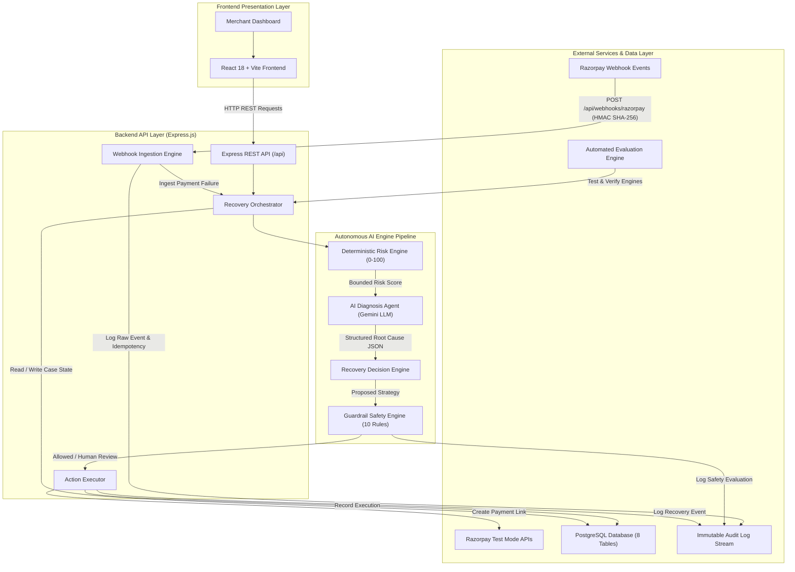

# RazorRecover AI — System Architecture Diagram Asset

---

## Architecture Component Mapping to Source Code

| Diagram Node | Technical File Path | Responsibilities |
| :--- | :--- | :--- |
| **Merchant Dashboard** | [`client/src/App.jsx`](file:///c:/Users/tamme/OneDrive/Desktop/revenue/client/src/App.jsx) | Top KPI summary cards, interactive table, judge demo bar. |
| **React 18 + Vite Frontend** | [`client/src/components/`](file:///c:/Users/tamme/OneDrive/Desktop/revenue/client/src/components) | UI component tree (`MetricsOverview`, `RecoveryCasesTable`, `CaseDetailModal`, `AuditLogStream`). |
| **Express REST API** | [`server/src/routes/index.js`](file:///c:/Users/tamme/OneDrive/Desktop/revenue/server/src/routes/index.js) | Central API routing table (`/api/metrics`, `/api/recovery-cases`, `/api/audit-logs`). |
| **Webhook Ingestion Engine** | [`server/src/services/webhookService.js`](file:///c:/Users/tamme/OneDrive/Desktop/revenue/server/src/services/webhookService.js) | HMAC SHA-256 signature verification over `req.rawBody` & event ID idempotency checks. |
| **Recovery Orchestrator** | [`server/src/controllers/simulationController.js`](file:///c:/Users/tamme/OneDrive/Desktop/revenue/server/src/controllers/simulationController.js) | Pipeline orchestrator coordinating risk calculation, diagnosis, decision, and guardrails. |
| **Deterministic Risk Engine** | [`server/src/services/riskEngineService.js`](file:///c:/Users/tamme/OneDrive/Desktop/revenue/server/src/services/riskEngineService.js) | 0–100 bounded mathematical scoring across 4 explainable factors. |
| **AI Diagnosis Agent** | [`server/src/services/aiDiagnosisService.js`](file:///c:/Users/tamme/OneDrive/Desktop/revenue/server/src/services/aiDiagnosisService.js) | Google Gemini LLM API integration with structured JSON schema validator. |
| **Recovery Decision Engine** | [`server/src/services/decisionEngineService.js`](file:///c:/Users/tamme/OneDrive/Desktop/revenue/server/src/services/decisionEngineService.js) | Strategy matching engine combining risk scores, AI recommendations, and merchant policies. |
| **Guardrail Safety Engine** | [`server/src/services/guardrailEngineService.js`](file:///c:/Users/tamme/OneDrive/Desktop/revenue/server/src/services/guardrailEngineService.js) | 10 sequential safety rules & high-value ($\ge$ ₹15,000) human approval gates. |
| **Action Executor** | [`server/src/services/recoveryExecutionService.js`](file:///c:/Users/tamme/OneDrive/Desktop/revenue/server/src/services/recoveryExecutionService.js) | Interacts with Razorpay SDK to create 1-click Payment Links with duplicate protection. |
| **Razorpay Test Mode APIs** | [`server/src/services/razorpayService.js`](file:///c:/Users/tamme/OneDrive/Desktop/revenue/server/src/services/razorpayService.js) | Official Razorpay Node SDK client wrapper (`key_id`, `key_secret`). |
| **PostgreSQL Database** | [`server/src/db/index.js`](file:///c:/Users/tamme/OneDrive/Desktop/revenue/server/src/db/index.js) | Parameterized SQL query pool for 8 relational tables (`paise` for money). |
| **Immutable Audit Log Stream** | [`server/src/controllers/auditLogController.js`](file:///c:/Users/tamme/OneDrive/Desktop/revenue/server/src/controllers/auditLogController.js) | Append-only security & audit trail ledger. |
| **Automated Evaluation Engine** | [`server/src/scripts/testPhase14Simulator.js`](file:///c:/Users/tamme/OneDrive/Desktop/revenue/server/src/scripts/testPhase14Simulator.js) | 104-test automated evaluation suite verifying end-to-end recovery pipeline integrity. |
